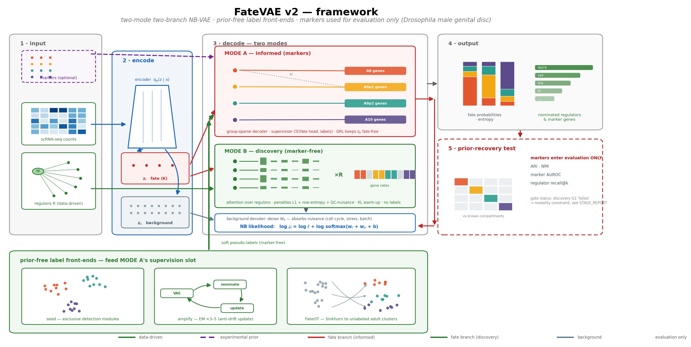

# FateVAE

Prior-informed variational detection of **cryptic fate heterogeneity** in
imaginal-disc single-cell transcriptomics.

In progenitor-dominant tissues, cells committed to different adult fates can be
statistically invisible: in the larval *Drosophila melanogaster* male genital
disc, four immunofluorescence-validated primordia (A8, A9p1, A9p2, A10) form a
single round cloud in standard UMAP/PCA embeddings, because fate identity is a
low-variance minority program (~1% of expression variance, vs ~22% in marker
space). FateVAE treats weak-signal fate discovery as a measured, gate-controlled
problem: a two-branch negative-binomial VAE whose prior dose (from zero marker
genes to full panels) is a single audited hyperparameter, extended with an
in-house unbalanced Sinkhorn optimal-transport layer and a graph-convolution
encoder whose recovery improves monotonically with training.



## Key results (all under one evaluation contract: markers enter evaluation only)

| version | mode / prior used | ARI (gate 0.30) | marker AUROC | outcome |
|---|---|---|---|---|
| v0.1 | Informed (full marker panels) | - | **0.874** (LOGO 0.789) | beats pipeline (0.805); prior-dependent |
| v0.2 | Discovery x8 (regulons only) | <= 0.031 | <= 0.743 | gate failed; causes diagnosed |
| v0.3 | Seed & Amplify (statistical seed) | 0.057 | 0.775 | recovers temporal axis, not space |
| v0.4 | Unbalanced Sinkhorn OT layer | - | 0.717 (FateOT) | ~3x kNN coupling; external wing-disc demo |
| v0.5 | Graph-convolution encoder | **0.278** | **0.848** | monotone scaling; gate within reach |

The measurable conclusion - the binding constraint is the *information content
of the data modality*, not the estimator - redirects the roadmap to a
minimal-marker curriculum and a second data axis (scATAC / spatial / staged
time series), before transfer to *D. suzukii* and vertebrate systems.

## Repository layout

```
fatevae/               core package
  config.py              central paths (data root via FATEVAE_DATA_ROOT env), fate groups, seeds
  io/                    provenance-aware AnnData/loom loaders (corrected-counts handled)
  priors/                marker modules (evaluation only) + co-expression regulon builder
  model/                 informed-mode two-branch NB-VAE; graph-convolution encoder (pure sparse torch)
  discovery/             statistical seed + EM amplification (prior-free front-end)
  ot/                    in-house log-domain entropic unbalanced Sinkhorn (validated vs LP)
  ot_teacher.py          FateOT: unlabeled adult clusters -> OT soft fates
  eval/                  prior-recovery metrics: ARI/NMI, held-out marker AUROC, silhouette, CHI
  grn/                   TF->fate attribution + in-silico perturbation
  fate/                  probability calibration, entropy, uncertainty
  baselines.py           HVG-PCA / regulon-PCA / marker-PCA references
scripts/               one-command phase pipelines + SLURM wrappers
  phase0_phenomenon.py   quantify the problem (variance decomposition, benchmarks)
  phase1_*.py            informed training, LOGO anti-circularity, discovery variants, Seed & Amplify, FateOT
  phase2_grn.py          TF->fate regression + perturbation
  phase3_ot_adult.py     larva->adult OT coupling grid vs matched kNN
  phase3_ot_wing.py      96h->120h wing-disc temporal coupling (public GSE155543)
  phase4_graphvae.py     graph-convolution encoder sweep
  make_report.py         regenerate results/RESULTS.md from results/tables at any time
  slurm_*.sh             SLURM CPU/GPU wrappers (cluster examples)
tests/test_smoke.py    synthetic-data smoke test of the full pipeline (no real data needed)
results/               auto-generated evidence: RESULTS.md, 45+ figures, 90+ metric tables
```

## Installation

```bash
conda env create -f environment.yml
conda activate fatevae
```

PyTorch runs on CPU (16 cores suffice for most phases); the graph-convolution
sweep benefits from a single GPU via the provided SLURM wrapper.

## Quickstart

```bash
# 1. smoke test (synthetic data, ~1 min, no downloads)
python tests/test_smoke.py

# 2. quantify the phenomenon (needs data, see below)
python scripts/phase0_phenomenon.py

# 3. informed-mode training + LOGO anti-circularity
sbatch scripts/slurm_fatevae.sh --tag run1 --adult-anchor      # or: python scripts/phase1_train_fatevae.py ...
sbatch scripts/slurm_logo.sh

# 4. prior-free front-ends and OT / graph layers
python scripts/phase1_discovery2.py --iters 5 --tag sa5
python scripts/phase1_fateot.py
python scripts/phase3_ot_adult.py
python scripts/phase4_graphvae.py --tag ginf --epochs-mult 32

# 5. regenerate the results report from results/tables
python scripts/make_report.py
```

## Data requirements

This repository ships **code and result artifacts only - no raw data**.

- **Primary data** (in-house *D. melanogaster* male genital disc scRNA-seq,
  larval L3, with immunofluorescence-validated fate markers, plus the merged
  larva+adult reference and pySCENIC regulon outputs): **available from the
  authors on reasonable request** - contact **kourongao@westlake.edu.cn**.
- **Public datasets** used for external demos are available from their
  original sources under their accessions: wing disc GSE155543 (Everetts et
  al., eLife 2021), eye disc GSE263102, leg disc PRJNA831899, accessory-gland
  snRNA PRJNA741528, zebrafish embryo GSE112294 (Farrell et al., Science 2018).

Point the code at your data copy via:

```bash
export FATEVAE_DATA_ROOT=/path/to/your/data   # expected layout documented in fatevae/config.py
```

Trained checkpoints are not redistributed (2.5 GB); every model is regenerated
by the scripts above with the fixed seeds in `fatevae/config.py`.

## Reproducibility notes

- Fixed seeds centrally in `fatevae/config.py`; every phase writes CSV tables
  and figures under `results/`, and `python scripts/make_report.py`
  regenerates `results/RESULTS.md` from them at any time.
- The evaluation contract is structural: marker genes enter only
  `fatevae/eval`-registered functions, never training; informed mode is
  additionally audited by leave-one-gene-out retraining.
- Gate decisions (pass/fail per version) were pre-registered and are recorded
  in the generated results; negative results are reported with diagnoses.
- SLURM wrappers are cluster examples: paths are configured via
  `FATEVAE_PYTHON` and submit-time relative paths.

## License

Released under the MIT License (see [LICENSE](LICENSE)).
