# FateVAE - results report (auto-generated)

## Phase 0 - cryptic fate heterogeneity quantification

**H1 test - between-fate variance fraction** (fate-signal dilution):

| representation | fate_variance_ratio | max_dim_eta2 |
|---|---|---|
| hvg_pca30 | 0.012 | 0.109 |
| regulon_pca10 | 0.021 | 0.098 |
| marker_pca | 0.215 | 0.377 |

> HVG-PCA carries ~1% fate-related variance while the marker subspace carries >20%: the fate signal exists but is diluted in variance-dominated embeddings.

**Embedding benchmark** (marker-gene recovery AUROC, silhouette on marker-defined fate labels, CHI):

| method | dim | heldout_marker_auroc | heldout_marker_auroc_sd | silhouette | CHI |
|---|---|---|---|---|---|
| hvg_pca30 | 30 | 0.805 | 0.068 | -0.028 | 0.000 |
| regulon_pca10 | 10 | 0.727 | 0.064 | -0.023 | -0.061 |
| marker_pca6 | 6 | 0.982 | 0.015 | 0.116 | 0.498 |

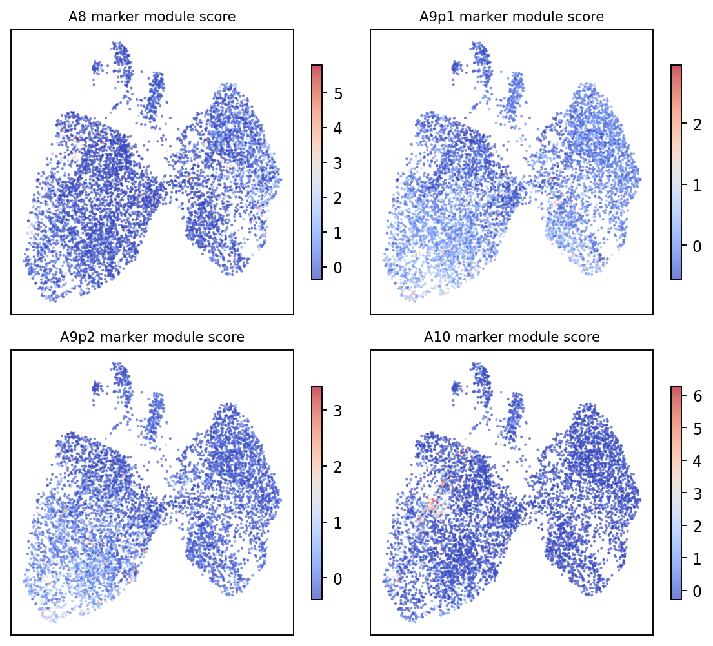

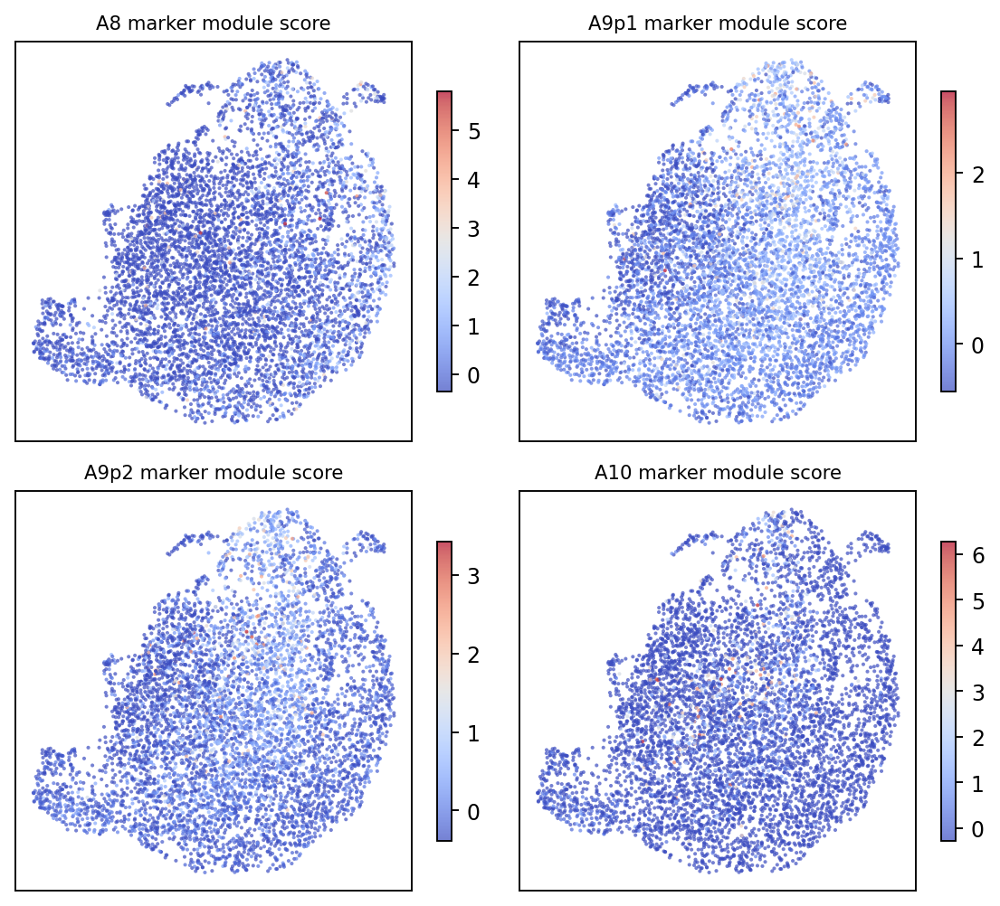

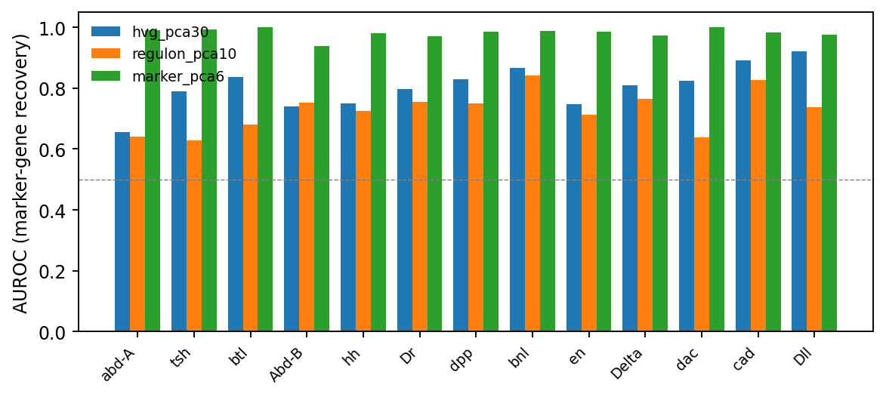

## Phase 1 - FateVAE training (`run1`)

| method | dim | heldout_marker_auroc | heldout_marker_auroc_sd | silhouette | CHI |
|---|---|---|---|---|---|
| hvg_pca30 | 30 | 0.805 | 0.068 | -0.028 | 0.000 |
| regulon_pca10 | 10 | 0.727 | 0.064 | -0.023 | -0.061 |
| fatevae_zf | 4 | 0.874 | 0.058 | 0.085 | 0.287 |
| fatevae_zb | 16 | 0.799 | 0.065 | -0.037 | -0.018 |
| fatevae_z | 20 | 0.913 | 0.035 | 0.013 | 0.208 |

**Adult-anchored cross-correlation** (rows: adult neighbour fractions; columns: model fate probabilities):

|  | Unnamed: 0 | A8 | A9p1 | A9p2 | A10 |
|---|---|---|---|---|---|
| 0 | accessory_gland | -0.039 | 0.138 | 0.015 | -0.073 |
| 1 | ejaculatory_bulb | -0.144 | 0.158 | 0.158 | -0.052 |
| 2 | ejaculatory_duct | 0.160 | -0.213 | -0.165 | 0.082 |
| 3 | seminal_vesicle | 0.003 | -0.009 | 0.015 | -0.006 |

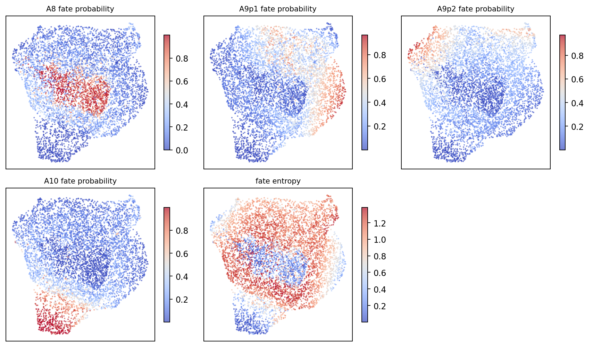

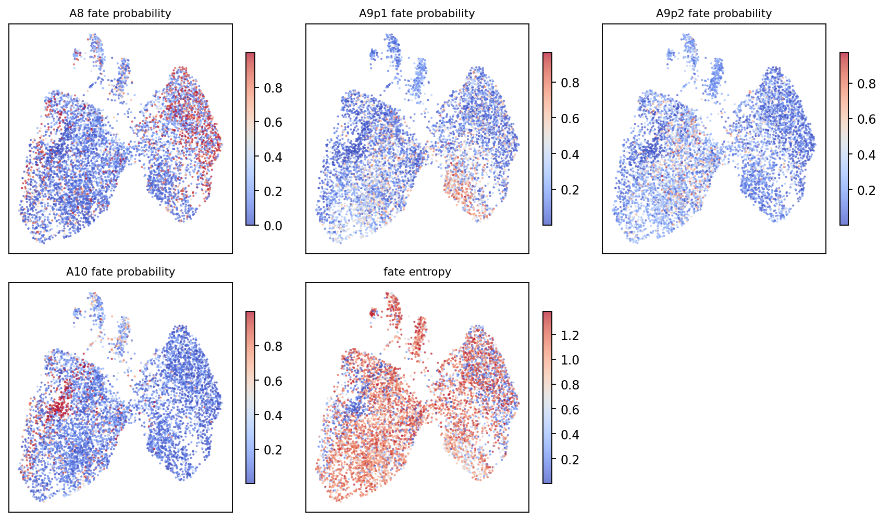

## Phase 1 - LOGO anti-circularity check

> Supervision excludes the held-out marker genes; AUROC measures whether the fate latent recovers them anyway.

|  | Unnamed: 0 | FateVAE_zf | HVG_PCA30 |
|---|---|---|---|
| 0 | mean | 0.789 | 0.801 |
| 1 | std | 0.115 | 0.069 |

## Discovery mode - prior-recovery test (v2)

> No experimental marker genes were used for gene selection,
> model structure, or training; markers enter only this
> evaluation. G1' gate: ARI >= 0.3 vs marker-defined
> compartments.

**Data-driven baselines**:

| method | ARI | NMI | marker_auroc |
|---|---|---|---|
| NMF_AUC_k4 | 0.005 | 0.011 | 0.643 |
| NMF_AUC_k8 | 0.023 | 0.028 | 0.655 |
| leiden_regulonPCA | 0.040 | 0.051 | 0.727 |

**FateVAE discovery variants** (regulon source / training):

| tag | method | ARI | NMI | marker_auroc |
|---|---|---|---|---|
| disc_k4 | DISCOVERY_FateVAE | 0.025 | 0.030 | 0.661 |
| discA | DISCOVERY_FateVAE | 0.032 | 0.048 | 0.694 |
| ss_k4 | DISCOVERY_FateVAE | 0.017 | 0.018 | 0.663 |
| ss_k6 | DISCOVERY_FateVAE | 0.017 | 0.023 | 0.683 |
| coexpA | DISCOVERY_FateVAE | 0.028 | 0.040 | 0.726 |
| bothA | DISCOVERY_FateVAE | 0.031 | 0.046 | 0.743 |

References: informed mode marker AUROC 0.874, HVG-PCA30
0.805. **Gate G1' failed for every prior-free variant** -
diagnosis: cisTarget pruning removed 10/14 known fate TFs
from the regulon prior; co-expression regulons (226, TF
coverage restored) improved AUROC to 0.743 but not cluster
recovery. Unsupervised objectives are dominated by the
~99% non-fate variance; partial supervision (LOGO 0.789,
informed 0.874) is what lifts recovery.

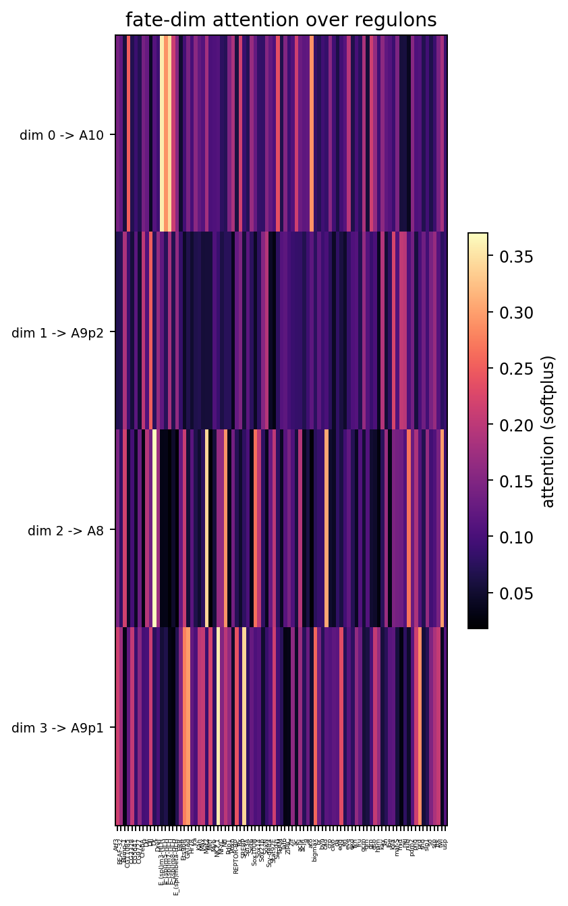

## Discovery mode v2.1 - Seed & Amplify (v0.3, self-supervised)

> Stage 1: anticoherent TF detection modules (statistical seed,
> no markers). Stage 2: EM loop - informed-mode VAE on seed
> pseudo-modules -> genome-wide nomination -> damped module
> update. Stage 3: prior-recovery test (markers enter here only).

| tag | ARI | NMI | marker_auroc | marker_auroc_sd |
|---|---|---|---|---|
| sa | 0.057 | 0.072 | 0.775 | 0.087 |
| sa_hvg | 0.023 | 0.037 | 0.753 | 0.069 |
| sa5 | 0.041 | 0.054 | 0.763 | 0.095 |
| sa5_s1 | 0.033 | 0.038 | 0.635 | 0.049 |

Best prior-free result so far: marker AUROC up to 0.775
(beats NMF/Leiden baselines 0.64-0.73, approaches HVG-PCA
0.805); amplified dim-fate |r| up to 0.50 (seed ~0.3, all
earlier variants <=0.3). Partition recovery (ARI) still fails
(gate 0.3). Diagnosis: the EM converges preferentially to the
 strongest anticoherent program in the data - the ecdysone/
temporal axis (br, Eip75B, lola, Tet, chinmo, ftz-f1 are
nominated de novo) - while the spatial compartment code stays
below the unsupervised detection threshold in scRNA alone.

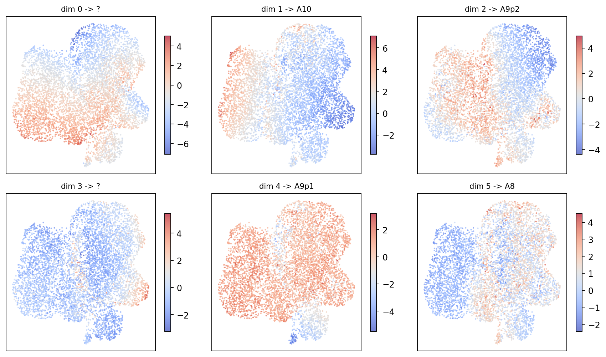

## Phase 3 - OT demos (v0.4)

**Demo 1: larva -> adult unbalanced OT** (merged PCA space).
(eps, tau) sensitivity of the plan mass and the best |Spearman| between OT fate mass and disc compartment scores; kNN-30 baseline for reference (v0.1: max |r|~0.21):

| eps | tau | mass | max_abs_corr |
|---|---|---|---|
| 0.020 | 1.000 | 1.031 | 0.098 |
| 0.020 | 5.000 | 1.003 | 0.104 |
| 0.020 | 50.000 | 1.000 | 0.108 |
| 0.050 | 1.000 | 1.218 | 0.112 |
| 0.050 | 5.000 | 1.038 | 0.114 |
| 0.050 | 50.000 | 1.003 | 0.118 |
| 0.100 | 1.000 | 1.680 | 0.154 |
| 0.100 | 5.000 | 1.111 | 0.155 |
| 0.100 | 50.000 | 1.010 | 0.155 |
| 0.200 | 1.000 | 3.332 | 0.240 |
| 0.200 | 5.000 | 1.292 | 0.238 |
| 0.200 | 50.000 | 1.026 | 0.238 |

Best-config cross-correlation:

| Unnamed: 0 | A8 | A9p1 | A9p2 | A10 |
|---|---|---|---|---|
| accessory_gland | 0.067 | -0.034 | -0.168 | -0.117 |
| ejaculatory_bulb | -0.017 | -0.067 | -0.134 | -0.120 |
| ejaculatory_duct | -0.056 | 0.027 | 0.216 | 0.204 |
| seminal_vesicle | 0.088 | 0.210 | 0.240 | 0.143 |

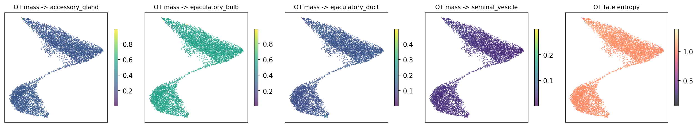

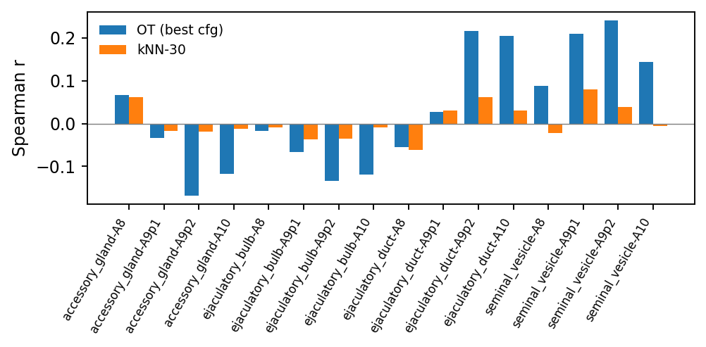

**Demo 2: wing disc 96h -> 120h temporal OT** (Everetts et al. 2021 archive, tag wing2): fate-continuity matrix (rows: 96h compartment top-quartile cells; cols: landed mass fraction in 120h compartments):

| Unnamed: 0 | pouch | notum | hinge_distal | peripodial | myoblast |
|---|---|---|---|---|---|
| pouch | 0.477 | 0.227 | 0.396 | 0.219 | 0.147 |
| notum | 0.241 | 0.354 | 0.197 | 0.232 | 0.236 |
| hinge_distal | 0.385 | 0.233 | 0.384 | 0.231 | 0.177 |
| peripodial | 0.233 | 0.232 | 0.194 | 0.282 | 0.279 |
| myoblast | 0.184 | 0.236 | 0.144 | 0.295 | 0.370 |

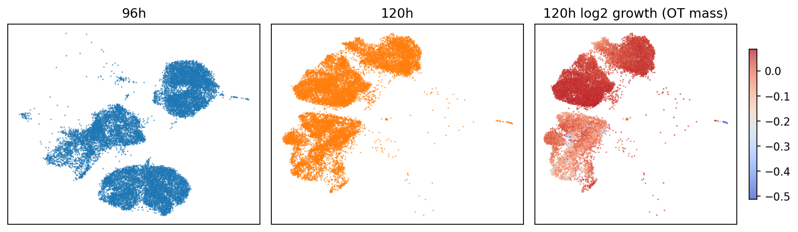

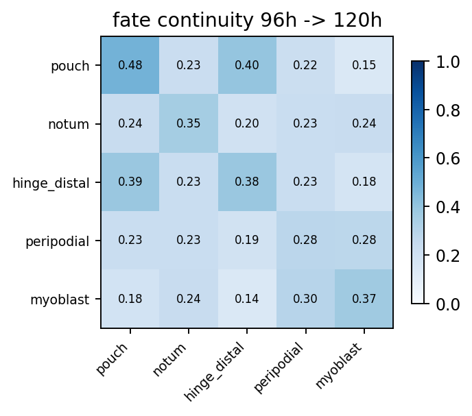

## Phase 4 - Graph VAE (disc-data-only; Guidance 3.4)

> GCN encoder (2-layer, sym-normalized kNN graph) + the
two-branch NB decoder. Same prior-recovery contract.
refs: informed-MLP 0.874, HVG-PCA 0.805, best prior-free
0.775.

| method | tag | ARI | NMI | marker_auroc |
|---|---|---|---|---|
| graph_informed | ginf | 0.059 | 0.062 | 0.739 |
| graph_informed | ginf_full | 0.069 | 0.085 | 0.784 |
| graph_informed | ginf_k30 | 0.060 | 0.074 | 0.778 |
| graph_informed | ginf_x2 | 0.094 | 0.114 | 0.815 |
| graph_informed | ginf_x4 | 0.120 | 0.138 | 0.822 |
| graph_informed | ginf_x8 | 0.158 | 0.173 | 0.832 |
| graph_informed | ginf_x16 | 0.241 | 0.255 | 0.845 |
| graph_informed | ginf_x32 | 0.278 | 0.293 | 0.848 |
| graph_discovery | gdisc_full | 0.049 | 0.058 | 0.768 |
| graph_discovery | gdisc_reg | 0.027 | 0.039 | 0.699 |
| graph_discovery | gdisc_x4 | 0.032 | 0.041 | 0.753 |

Findings: graph aggregation lifts per-dim fate
correlations to |r| 0.4-0.6 (vs 0.1-0.3 for MLP
encoders) - the denoising mechanism works; longer
training keeps improving ARI monotonically (0.069 ->
0.094 -> 0.120 -> 0.158 -> 0.241 -> 0.278 at
x1/x2/x4/x8/x16/x32, gate 0.3 within reach) while
denser graphs (k=30) over-smooth; unsupervised graph
mode degrades with longer training.

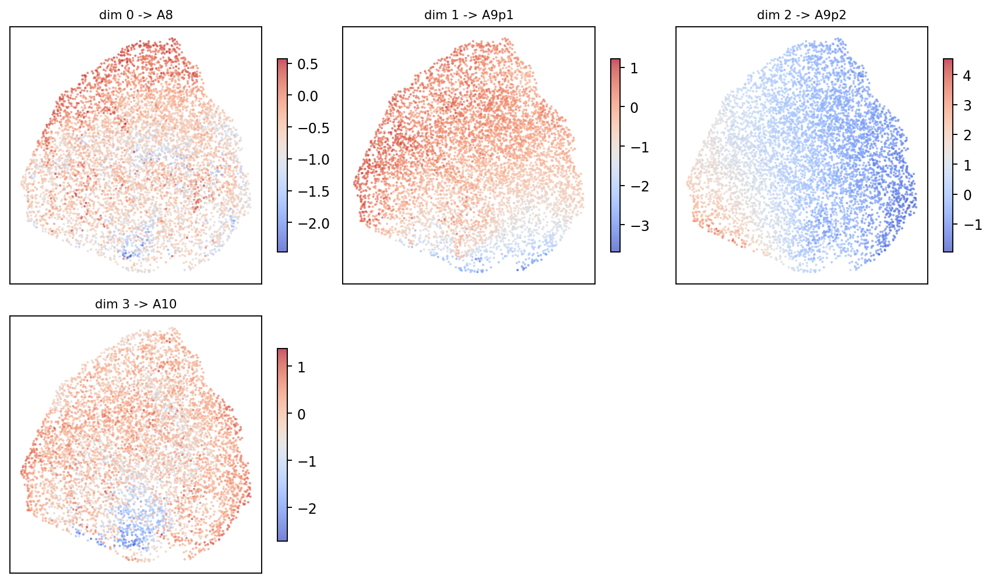

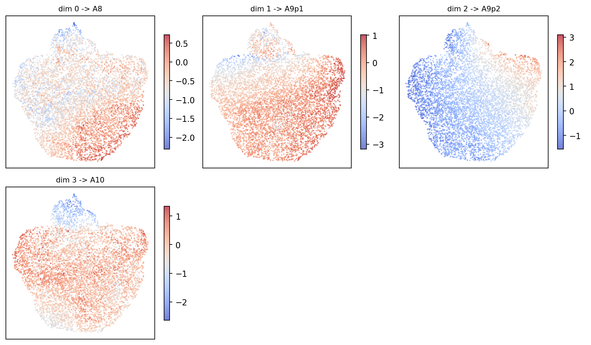

## Phase 2 - TF -> fate attribution (v0.1 linear probe)

| TF | A8 | A9p1 | A9p2 | A10 |
|---|---|---|---|---|
| Atf3 | 0.092 | -0.025 | -0.135 | 0.068 |
| BEAF-32 | 0.013 | 0.060 | 0.007 | -0.080 |
| Blimp-1 | 0.039 | -0.018 | 0.028 | -0.049 |
| CG11085 | 0.025 | 0.012 | 0.018 | -0.055 |
| CG3328 | 0.045 | -0.014 | -0.018 | -0.013 |
| CG5641 | 0.018 | -0.028 | 0.012 | -0.002 |
| CG9727 | -0.029 | -0.007 | 0.009 | 0.027 |
| CrebA | 0.014 | 0.042 | -0.074 | 0.018 |
| Dif | -0.025 | 0.028 | 0.020 | -0.024 |
| Dll | 0.105 | 0.393 | -0.175 | -0.322 |
| Dr | 0.063 | 0.275 | -0.238 | -0.101 |
| Dref | -0.041 | 0.046 | 0.023 | -0.028 |
| E_(spl)m3-HLH | -0.152 | 0.093 | 0.031 | 0.028 |
| E_(spl)m5-HLH | 0.018 | 0.001 | -0.033 | 0.014 |
| E_(spl)m7-HLH | 0.051 | -0.047 | -0.034 | 0.029 |
| E_(spl)m8-HLH | -0.036 | -0.006 | 0.046 | -0.004 |
| E_(spl)mbeta-HLH | 0.107 | -0.007 | -0.066 | -0.033 |
| ERR | 0.009 | 0.015 | -0.045 | 0.022 |
| Ets96B | -0.010 | 0.015 | -0.008 | 0.003 |
| GATAd | 0.008 | -0.024 | -0.011 | 0.027 |
| Hr78 | 0.030 | -0.036 | -0.006 | 0.012 |
| Jra | 0.036 | -0.018 | -0.020 | 0.002 |
| Kah | -0.063 | 0.018 | 0.017 | 0.028 |
| Max | -0.041 | 0.039 | -0.039 | 0.041 |
| Mef2 | 0.247 | -0.105 | -0.112 | -0.030 |
| Mitf | -0.012 | 0.018 | 0.043 | -0.050 |
| Myb | -0.008 | -0.067 | 0.056 | 0.019 |
| NK7.1 | 0.033 | 0.183 | 0.115 | -0.332 |
| Nf-YC | 0.018 | 0.025 | -0.028 | -0.015 |
| NfI | 0.016 | -0.002 | 0.006 | -0.021 |
| Pdp1 | 0.021 | 0.013 | -0.001 | -0.033 |
| Poxn | -0.022 | -0.003 | 0.060 | -0.035 |
| REPTOR-BP | 0.030 | 0.026 | -0.021 | -0.036 |
| Rx | 0.004 | -0.028 | 0.024 | -0.000 |
| SREBP | 0.020 | -0.002 | 0.035 | -0.053 |
| Sin3A | 0.028 | -0.007 | -0.028 | 0.007 |
| Sirt6 | -0.011 | -0.053 | 0.033 | 0.030 |
| Sox100B | -0.009 | -0.096 | 0.101 | 0.003 |
| Sox14 | 0.015 | -0.013 | -0.018 | 0.016 |
| Sox21b | -0.030 | 0.041 | 0.077 | -0.088 |
| SoxN | 0.033 | 0.027 | 0.040 | -0.101 |
| Sry-delta | -0.065 | 0.021 | 0.080 | -0.036 |
| Stat92E | 0.001 | 0.032 | -0.006 | -0.027 |
| Su_(H) | 0.057 | 0.013 | 0.028 | -0.099 |
| TFAM | 0.008 | 0.020 | -0.007 | -0.022 |
| Taf6 | -0.016 | 0.013 | -0.020 | 0.023 |
| ZIPIC | -0.080 | -0.010 | 0.049 | 0.041 |
| Zif | -0.034 | 0.008 | 0.031 | -0.005 |
| ac | 0.043 | -0.039 | 0.041 | -0.045 |
| achi | -0.052 | 0.024 | 0.064 | -0.037 |
| acj6 | -0.060 | 0.041 | 0.031 | -0.012 |
| al | 0.000 | -0.017 | 0.032 | -0.015 |
| ato | 0.016 | 0.033 | 0.008 | -0.057 |
| bigmax | -0.040 | -0.001 | -0.007 | 0.049 |
| br | -0.112 | -0.054 | -0.000 | 0.166 |
| byn | 0.019 | -0.021 | -0.023 | 0.025 |
| cad | -0.116 | -0.361 | -0.071 | 0.548 |
| crp | -0.064 | 0.035 | 0.046 | -0.017 |
| cwo | 0.056 | 0.078 | -0.097 | -0.037 |
| da | -0.015 | -0.031 | 0.035 | 0.011 |
| egg | -0.003 | -0.003 | 0.003 | 0.003 |
| en | -0.072 | -0.034 | 0.022 | 0.084 |
| eve | -0.079 | -0.044 | -0.016 | 0.138 |
| exd | 0.012 | 0.002 | 0.022 | -0.036 |
| fkh | -0.022 | -0.011 | 0.029 | 0.003 |
| fru | 0.027 | 0.070 | -0.071 | -0.025 |
| gcm | -0.004 | 0.009 | -0.024 | 0.019 |
| grh | -0.419 | -0.204 | 0.300 | 0.323 |
| grn | -0.045 | 0.008 | 0.076 | -0.039 |
| gsb | -0.017 | -0.039 | 0.135 | -0.079 |
| ham | -0.004 | 0.039 | -0.018 | -0.017 |
| kay | 0.029 | -0.195 | -0.071 | 0.237 |
| kn | 0.009 | -0.040 | -0.052 | 0.083 |
| lbe | -0.014 | -0.002 | -0.016 | 0.032 |
| lola | 0.600 | 0.288 | -0.150 | -0.738 |
| maf-S | 0.003 | 0.029 | -0.089 | 0.057 |
| mid | 0.048 | -0.098 | -0.027 | 0.077 |
| nej | -0.393 | 0.000 | 0.111 | 0.281 |
| nub | -0.019 | -0.078 | 0.057 | 0.039 |
| pdm2 | -0.059 | -0.002 | 0.021 | 0.040 |
| pho | 0.023 | 0.049 | -0.078 | 0.007 |
| prd | -0.030 | 0.038 | 0.028 | -0.036 |
| shn | -0.086 | -0.046 | 0.021 | 0.112 |
| slp1 | 0.099 | 0.011 | -0.007 | -0.102 |
| so | 0.037 | 0.002 | 0.059 | -0.099 |
| srp | -0.048 | 0.026 | -0.006 | 0.027 |
| ttk | -0.049 | 0.064 | 0.072 | -0.086 |
| twi | 0.181 | -0.056 | -0.109 | -0.016 |
| usp | -0.005 | -0.009 | 0.041 | -0.027 |

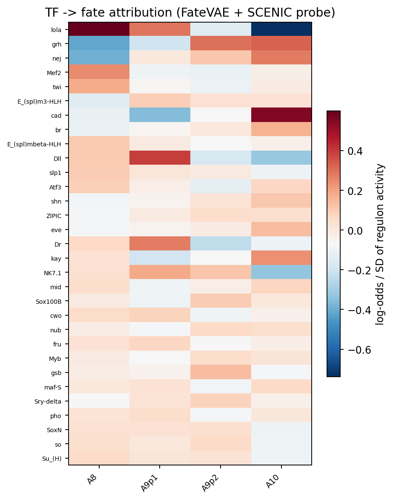
